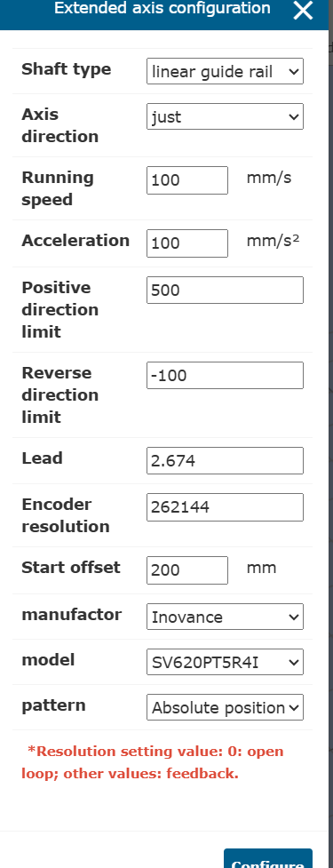
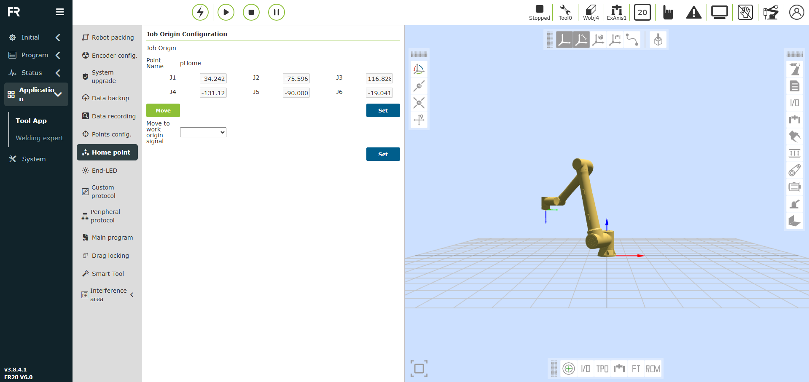

# FrPalletizingSetup
This repo is a step by step instruction for settings up a Fairino palletizing solution.

## Contents of repo:
-   Rail Up documentation and set up instructions

Video for Rail Set up step-by-step:

    https://drive.google.com/drive/folders/1Kpjjic1A1EnLq9yDP_YpjaPuU1yFIZyL

If you run into problems not mentioned on this repo, try looking at the Inovance documentation here:

    https://www.inovance.eu/fileadmin/downloads/Servo_drives_and_motors/SV660N_Advanced_User_Guide.pdf

## Step 1: Putting your solution together:
Start by first hooking up your solution 

## Step 2: Set up Encoder
- When setting up the rail, you may get communication errors on the encoder that read E731.0
- If you see this, do the following:
    1) Flip up the screen at the top of the encoder and press "Mode" (or "Set" first, I can't remember as im writing this). It will then allow you to modify the register value that you'd like to edit.
    2) Use the up/down arrows to adjust the values of the register until you see get "h0d.20" and press "set"
    3) Here, you should see a blinking "0". You'll need to set that to "1"  (using the up arrow) press set and then power cycle.
## Step 3: Communicating the robot to the rail:
- The provided code should have the propper UDP set up, but you'll need to give it the values the first time you set it up. Screen shots of the correct parameters can be found in this repo.
 - In "Initial"->"Peripheral"->"Ext. Axis" select Ext. Axis + UDP.
 - Change exaxis number to 1
 - Edit the "Communication config" to have the following values:

    - IP address: 192.168.57.88
    - Port number: 2021
    - Communication cycle: 2ms
    - Packet loss detection time: 50ms
    - Packet loss times: 10
    - Communication interval: 50 ms
    - Automatic reconnection after interuption: enabled
    - Reconnection period: 2ms
    - Number of reconnections: 5
    - Position completion time: 1000ms

 - Click configure, load, and then save (the checkmark at the top)
 - Navigate to "Initial"->"Base"->"Coordinate"->"Ext. Axis"
 - Select extaxis1
 - Click edit, select "param config" and enter the following values: 

 - Click save and then the check mark at the top
 - Now you're good to go!

## OPTIONAL Step 4: Setting up the Extended Axis coordinate system for synchronous movement
- When setting up your extended axis, you can calibrate the extended axis to allow synchronous movement of the rail and the robot.
- After following the steps above, navigate to "Initial"->"Base"->"Coordinate"->"Ext. Axis"
- Click on the "Edit" button (notepad with a pencil icon) and towards the bottom, double click "Clear" then click "calibrate"
- As an example, these are the coordinates and steps for calibrating a vertical rail:
    - For point 1, navigate to the coordinate move tab in the main page of the web app (the bottom of the 4 icons on the left of the view window)
    - Set your Rail to 0 and enter the following coordinates:
        Point 1

            X: 855
            Y: 0
            Z: 0
            RX: 180
            RY: 0
            RZ: -180
    
    - For Point 2, Move the coordinates to the following:
        Point 2:

            X: 855
            Y: 0
            Z: 0
            RX: 135
            RY: 0
            RZ: -135

    - For Point 3, You'll need to move your rail up 100mm while moving the robot down 100mm on the Z-axis
        Point 3:
        
            X: 855
            Y: 0
            Z: -100
            RX: 180
            RY: 0
            RZ: -180
            Ext Axis: 100mm

    - For point 4, first move your rail back to 0 and your robot back to 0 on the Z axis. Then, move the center point of your TCP in an axis perpendicular to your rail. In the case of a vertical rail, we move our robot in Y positive: 
        Point 4:

            X: 855
            Y: 100
            Z: 0
            RX: 180
            RY: 0
            RZ: -180
            Ext Axis: 0mm

- Now, when you click calculate, you can see the offsets of your new extended axis coordinate system. Click save and the check mark in the top of the window to save it. In the web app, you can view a visual representation of the axis by clicking the Extended Axis coordinate button on the top row of the view window.

- NOTE: This coordinate system will change the way you give points offsets in PTP and linear movements. Typically, in this example, the X axis will be vertical meaning to do a vertical offset, you'll need to give it an offset in the dx field.

## Notes for developers:
### Using the Fairino palletizing software
- When using the Fairino palletizing software, a common error developers run into when setting the parameters for the recipe is "No data for reference point".

- This can be solved by navigating to "Application -> Tool App -> Home Point" and clicking "set" (shown below)

- Note that this will serve as your home/pickup position for your palletizing program. After setting this point, you will be able to create the rest of your recipe

### Extended Axis Offset
- If your extended axis direction is flipped, modify the value of register H02-02. To edit, ensure the rail is disabled. After editing, you must power cycle the solution.

### Extended axis "Out of Soft Limit" Error:
- Sometimes, the extended axis will read the palletizers position as a very extreme value that is out of the soft limit range. To fix this, you must first unplug the PLC and set the web app to not be configured for an extended axis. Then, reset all the values in the configuration tab to the values shown in the image at the end of step 3. Now, turn off the solution, reset your PLC connection and you'll see that value return to normal!